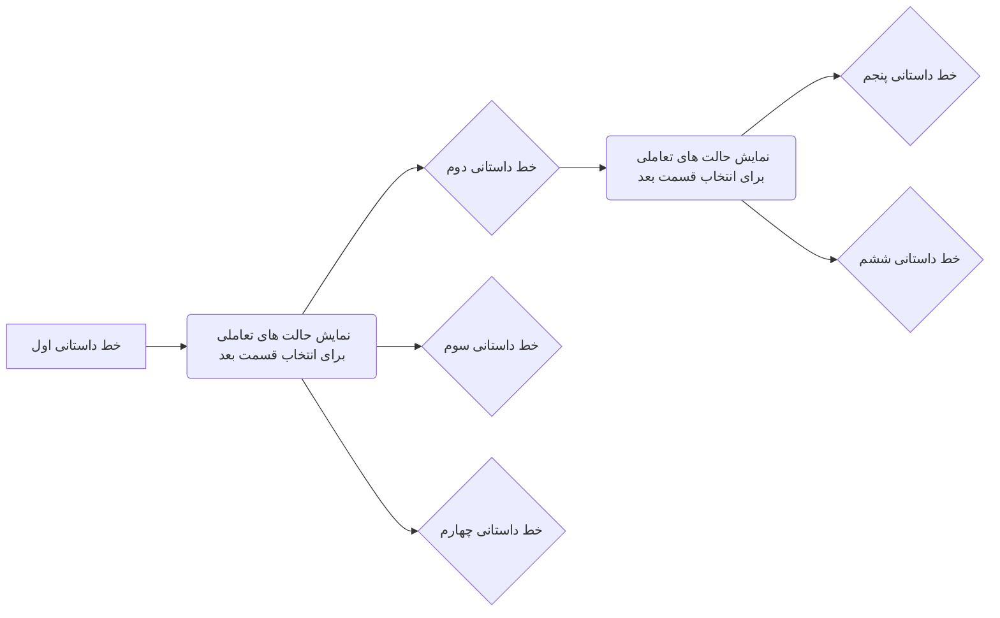

# رسانه تعاملی سها‌سیمرغ

# هدف : 

هدف از رسانه ی تعاملی سیمرغ ،‌ساخت پلتفرمی است که فرآیند نمایش را برای کاربر تا جای ممکن تبدیل به تجربه ی شبه‌بازی کنم و از طرفی ،فرآیند تغییر و به روز رسانی خط داستانی را برای ارائه دهندگان فیلم ،‌راحت و در سریعترین زمان ممکن انجام دهد !

# نیازمندی های اصلی :

## ۱- پنل نمایش سینمای تعاملی :

 ساخت پلتفرم پخش و توزیع فیلم به کمک فناوری های 

- تورنت
- دیتابیس های نظیر به نظیر (P2P)

برای ساخت تجربه ای مدرن ،سریع و به دور از دردسر های مرسوم شبکه های توزیع محتوای کلاسیک

این بخش که پلیر اصلی فیلم است و مخاطبین نهایی از طریق تعامل با این بخش می توانند به تماشای فیلم بپردازد

در این بخش سناریو های زیر قایل پیاده سازی است :

- قابلیت ارسال دیدگاه و نظر بر بخش های مختلف فیلم مثل ساند کلاد
- قابلیت ورود و ذخیره سازی مسیر های کاربر ،برای ادامه و پیگیری مسیر های فیلم در بخش های دیگر
- قابلیت به روز رسانی و تغییر خطوط داستانی همزمان و بدون نیاز به تغییرات اساسی در شبکه ( فایل ها و مسیر های انتخابی همواره و به صورت دینامیک قابل تغییر هستند ! )
- 

## ۲- پنل ایجاد و مدیریت خطوط داستانی :

در این بخش به کمک چارتهای گراف و درختی ،‌ارائه گر فیلم می تواند خطوط داستانی مختلفی برای برای نمایش فیلم خود انتخاب کند و تجربه های مختلفی از نمایش تعاملی را به مخاطبین نمایش دهد

در این بخش فایل های نهایی هر بخش وارد پنل میشوند و مدیریت انتخاب میکند بعد از پایان هر قسمت ،‌

- چه انتخاب هایی

- چه قسمت هایی

  از فیلم نمایش دهد

از طرفی چون شبکه بر بستر P2P پیاده سازی شده است ،‌فرآیند به روز رسانی خط داستانی اصلی به صورت لحظه ای در کل شبکه مخاطبین به روز می شود .

## ۳- سرور های ناظر 

هسته اصلی توزیع محتوا و نگه داری داده های شبکه را به عهده می گیریند ،‌این سرور های قابلیت هماهنگ سازی و آماده سازی سریع و اتوماتیک دارند برای همین در حالت هایی که شبکه دچار کمبود منابع میشود می توان در سریعترین و کمترین زمان ممکن ،‌سرور های کمکی را وارد شبکه کرد تا تجربه ی نمایش و تعامل کاربران با سینمای تعاملی دچار کندی و مشکل نشود !
